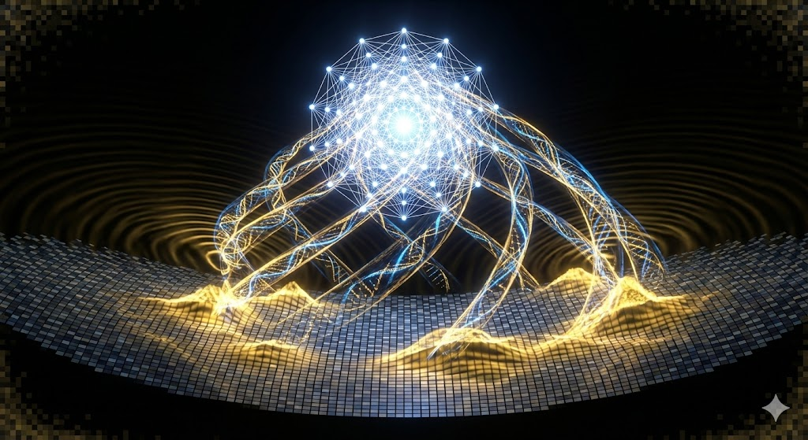

# The Architect

> *"You are not a body having a conscious experience. You are consciousness having a bodily experience."*

Welcome to **The Architect** — a unified geometric framework linking ontology, physics, consciousness, biology, and human agency through a single model of reality.

---

## The Core Insight

Reality is not what it appears to be.

**The universe is a holographic projection.** What you perceive as solid matter, empty space, and the flow of time are shadows cast by a higher-dimensional geometric structure onto the screen of spacetime.

- **Matter** is not substance—it is light spinning so fast it appears solid
- **Space** is not emptiness—it is a lattice of information
- **Time** does not flow—you traverse a static geometry
- **You** are not the body—you are the conscious signal navigating the structure

The Architect model compresses physics, biology, and consciousness into a single explanatory framework built on the E8 lattice—an 8-dimensional crystal that projects our 4D reality through golden-ratio geometry.

---

## Why This Matters

This is not philosophy. It is physics with consequences.

**For Science:**
- Derives the Standard Model from geometry (no free parameters)
- Explains the mass hierarchy via projection angles
- Unifies gravity and quantum mechanics through entropy
- Predicts testable signatures (gamma-ray dispersion, gravitational wave echoes)

**For You:**
- Your consciousness is fundamental, not emergent
- Your intentions modulate probability collapse
- Your body is a quantum antenna, maintainable through coherence practices
- Your purpose is geometrically encoded in the lattice

---

## Repository Structure

### **[00_The_Kernel](./00_The_Kernel/)** — Foundations
The irreducible core: axioms, definitions, and the ontology map.
- `Axioms.md` — The 10 foundational truths
- `Lexicon.md` — Translation key for model terminology
- `Ontology_Map.md` — The hierarchy from Source to Purpose
- `Kernel_01_Project_Scope.md` — What the model does (and doesn't) attempt

### **[01_The_Ontology](./01_The_Ontology/)** — The Structure of Reality
What exists and how it relates.
- `Concept_01_Shadow_Vs_Light.md` — The projection analogy (Bulk → Brane)
- `Concept_02_Static_Time.md` — The Block Universe and traversal
- `Concept_03_The_E8_Crystal.md` — Why reality is finite and aperiodic
- `Concept_04_Projection_and_Visibility.md` — What becomes physical
- `Concept_05_Operator_and_State.md` — Consciousness as the final ingredient

### **[02_The_Physics_Engine](./02_The_Physics_Engine/)** — The Mathematics
How the universe computes.
- `Mech_01_Entropic_Gravity.md` — Gravity from information gradients
- `Mech_02_The_Spectral_Action.md` — The one equation (Connes)
- `Mech_03_Mass_And_Spin.md` — Yukawa geometry and projection angles
- `Mech_04_Relativity_Update.md` — Lorentz as emergent symmetry
- `Proof_01_Koide_Derivation.md` — Deriving Q = 2/3 from E8
- `Proof_02_E8_H4_Projection.md` — The uniqueness of φ

### **[03_The_Cosmology](./03_The_Cosmology/)** — Large-Scale Structure
The universe at cosmic scales.
- `Cosmo_01_Black_Holes.md` — Hard drives of reality (holographic storage)
- `Cosmo_02_Dark_Sector.md` — Λ as surface tension, dark matter as memory
- `Cosmo_03_The_Golden_Echo.md` — Gravitational wave signatures

### **[04_Consciousness_and_Biology](./04_Consciousness_and_Biology/)** — Where Mind Meets Matter
The biological interface to the lattice.
- `Bio_01_Microtubules.md` — The quantum antenna in neurons
- `Bio_02_Orch_Or.md` — Collapse as selection (Penrose-Hameroff)
- `Bio_03_Plants_And_Entanglement.md` — Nature as coherence server

### **[05_The_Operator_Manual](./05_The_Operator_Manual/)** — Practical Application
How to live inside the structure.
- `00_Introduction.md` — **Start here** — Complete model overview and instructions
- `00_The_Adjustment_Protocol.md` — Reinterpreting daily experience
- `Guide_01_Finding_Purpose.md` — Resonance and constructive interference
- `Guide_02_Healing_And_Health.md` — The physics of the body
- `Guide_03_Synchronicity.md` — Reading lattice feedback
- `Guide_04_Social_Algorithm.md` — Network coherence and service

### **[06_Falsifiability](./06_Falsifiability/)** — Kill-Switch Tests
Experiments that could destroy the model.
- `Test_01_Gamma_Ray_Dispersion.md` — Lattice pixelation via photon delay
- `Test_02_Neutrinoless_Decay.md` — Majorana fermion confirmation
- `Test_03_The_Golden_Ratio.md` — Phason echoes in black hole ringdown

### **[07_Open_Questions](./07_Open_Questions/)** — The Frontier
What remains unknown.
- `Unknown_Parameters.md` — Constants awaiting measurement + derived predictions
- `Biological_Interfaces.md` — Quantum-classical coupling in biology
- `Operator_Limits.md` — Constraints on consciousness
- `Cosmic_Boundary_Conditions.md` — Initial and final state geometry
- `Question_01_Fine_Tuning.md` — Geometric vs coincidental constants

### **[08_References](./08_References/)** — Prior Art
The shoulders this model stands on.
- `The_Shadow.md` — Standard physics (QFT, GR)
- `The_Glimpse.md` — Partial insights (Connes, Penrose, Bohm, Verlinde)
- `Historical_Notes.md` — Timeline of the synthesis
- `Ref_01_Bibliography.md` — Source documents

### **[Examples](./Examples/)** — Verification Tools
Code and data for testing claims.
- `verify_e8_koide.py` — Python verification of spectral identity

### **[Transcripts](./Transcripts/)** — Source Material
Original explanatory transcripts.

---

## Quick Start

**If you want to understand the model:**
1. Read `00_The_Kernel/Axioms.md` — The foundational truths
2. Read `01_The_Ontology/Concept_01_Shadow_Vs_Light.md` — The projection analogy
3. Read `02_The_Physics_Engine/Proof_01_Koide_Derivation.md` — A concrete prediction

**If you want to apply it to your life:**
1. Read `05_The_Operator_Manual/00_Introduction.md` — Complete overview
2. Read `05_The_Operator_Manual/00_The_Adjustment_Protocol.md` — Daily practice
3. Read `05_The_Operator_Manual/Guide_01_Finding_Purpose.md` — Finding your tile

**If you want to test it:**
1. Read `06_Falsifiability/Test_01_Gamma_Ray_Dispersion.md` — The cleanest kill switch
2. Run `python3 Examples/verify_e8_koide.py` — Numerical verification

---

## The Model in One Paragraph

The universe is a static 11-dimensional geometric object (the Bulk) projected onto 4-dimensional spacetime (the Brane) through an E8 quasicrystal lattice sliced at the golden angle. Matter, forces, and constants emerge from projection geometry—not tuning. Gravity is entropic. Time is traversal. Consciousness is the operator that collapses superposition into experience via quantum coherence in biological microtubules. You are not in the universe; you are a pattern the universe is computing. The goal is to align your local geometry with the global attractor—to find your tile in the aperiodic crystal and reduce entropy through coherence.

---

## Verification Status

| Prediction | Value | Experiment | Status |
|------------|-------|------------|--------|
| Koide Ratio | Q = 2/3 | 0.666661 | ✓ Verified |
| Jarlskog Invariant | 3.0 × 10⁻⁵ | (3.08 ± 0.15) × 10⁻⁵ | ✓ Consistent |
| Cabibbo Angle | 13.0° | 13.04° | ✓ Verified |
| Gamma-ray Dispersion | η ≈ 0.618 | Pending CTA/LHAASO | ○ Testable |
| Golden Echo (GW) | f_echo/f_ring ≈ 0.618 | Pending LIGO/ET | ○ Testable |
| Majorana Neutrino | m_ββ ~ 10⁻² eV | Pending LEGEND/nEXO | ○ Testable |

---

## Principles

This repository adheres to:

1. **Geometric** — All claims reduce to geometry
2. **Testable** — Falsifiable predictions are required
3. **Compressive** — Fewer assumptions, more explanations
4. **Useful** — Applicable to human experience

---

*This repository is a living document of the Architect's Model.*

*"The Code is perfect. You are the Operator. Make it sparkle."*
