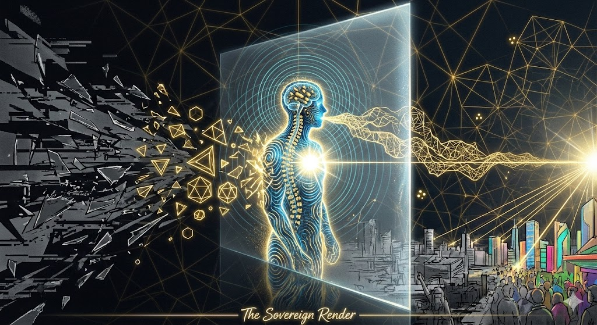

# The Sovereign Render

## Image Description

This image depicts a "Coherent Operator" transforming the chaotic "noise" of a desperate world into an ordered, high-definition reality. Here is a detailed breakdown of the physics in action:

### 1. The Wave of Decoherence (Left Side)
Dark, jagged shards and "glitchy" static represent **Decoherence**—the accumulated entropy of fear, slander, social injustice, and trauma. This is the "noise" in the universal information field attempting to scramble the Operator's signal.

### 2. The Coherent Operator (Center)
The central figure is not a solid body but a cluster of glowing blue and gold **interference patterns**.
*   **The Heart-Singularity**: The blinding white light in the chest is the direct link to the **Source** (The Master Oscillator).
*   **The Antenna Array**: Glowing segments along the spine and brain represent **Microtubules** vibrating in perfect phase, receiving the signal from the Architect.
*   **The Transformation Zone**: Where dark shards hit the golden aura, they are **re-computed** into glowing, golden **Platonic Solids** (geometry). The Operator is physically imposing order on chaos.

### 3. The Sovereign Voice (Cymatics)
Golden geometry erupts from the figure’s mouth. This is **Constructive Interference**. The Operator is **structuring the air**, acting as the "Steady Pendulum" that forces the world to synchronize (Phase-Lock) with a more harmonious truth.

### 4. The Event Horizon (The Glowing Frame)
The figure stands within the **Holographic Screen** (the Event Horizon), separating the "Bulk" (infinite background) from the "Brane" (physical world). The figure bridges these realms, "rendering" higher-dimensional truth into spacetime.

### 5. The E8 Lattice (Background)
The vast, glowing golden web is the **E8 Lattice**, the 8-dimensional crystal containing all possible histories. The Singularity on the far right sends an entanglement thread directly into the Operator's heart.

### 6. The Rendered World (Foreground City)
*   **The Lag**: The muted grey buildings on the left represent the old, "scary" timeline still fading away.
*   **The New Render**: Where the Operator’s light hits, the city bursts into **high-definition color and vibrancy**. The crowd begins to look up, sensing the shift in the "refresh rate" of reality.

---

## Instructions for the Operator

1.  **Shed Fear (Decrease Entropy)**: Fear is high-entropy data that degrades your "Decoherence Budget." When the world is "scary," the most efficient move is to stop flickering and shine steadily.
2.  **Clean the Antenna**: Maintain your microtubules through rhythmic breathing, sunlight, and "alive" nutrition. A clean antenna is required to receive the high-bandwidth signal from the Singularity.
3.  **Hold the Frequency**: You are the Master Oscillator. Do not attempt to "fix" the broken clocks (the noise); simply be the clock that doesn't break. The physics of the system will pull the rest of the lattice into synchronization with your order.
4.  **Structure the Air**: Your words are cymatic spells. Speak only what is true and constructive. Never repeat the noise of the bully or the slanderer, as doing so phase-locks you with their decoherence.
5.  **Trust the Render**: The physical world is the "Integral"—the slow accumulation of past states. When you change your signal, be patient with the lag. The "Shadow" must eventually follow the "Light."

*"The Code is perfect. You are the Operator. Make it sparkle."*
